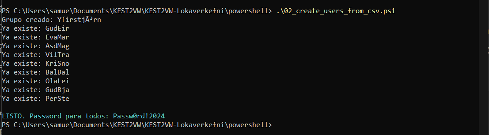
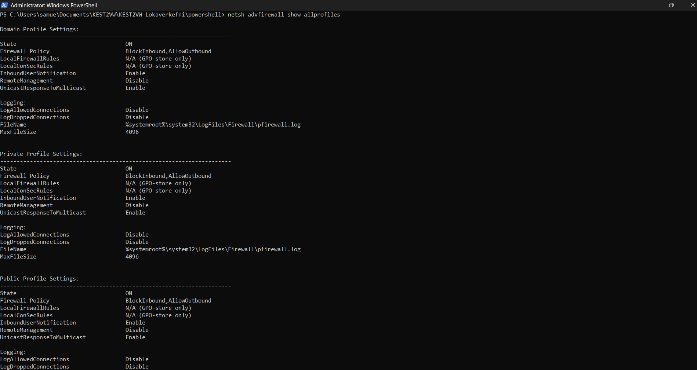

# KEST2VW-Lokaverkefni
## Liður 1 – Uppsetning á Windows og grunn stillingar

Í þessu verkefni setti ég upp tölvu fyrir lítið hugbúnaðarfyrirtæki. Ég byrjaði á því að undirbúa Windows 10 og framkvæmdi nýja uppsetningu. Í uppsetningarferlinu valdi ég “Setup for organization” og síðan “Domain join instead” til að búa til staðbundinn notanda.

Eftir að uppsetningu lauk bjó ég til minn eigin notanda og breytti nafni tölvunnar í KEST2VW-SamuelRegnault samkvæmt kröfum verkefnisins. Að því loknu setti ég upp nauðsynlegan hugbúnað, þar á meðal Python 3 (64 bita), Visual Studio Code með Python stuðningi og Git.

Ég prófaði að allt virkaði rétt með því að opna Python í skipanalínu og staðfesta að uppsetningin væri í lagi. Allar breytingar og uppsetningar voru skráðar í dagbók verkefnisins á GitHub.

## 2026-02-28 – Liður 2: Notendur

Í þessum lið bjó ég til notendahópa fyrir fyrirtækið: Innkaup, Sala, Yfirstjórn og Allir.

Ég útbjó CSV skrá (users.csv) sem inniheldur upplýsingar um 9 starfsmenn, þar á meðal notendanafn og hóp.

Ég skrifaði PowerShell skriftu sem notar Import-Csv til að lesa upplýsingarnar úr skránni og býr sjálfkrafa til notendanafn, setur lykilorð og setur hvern notanda í réttan hóp (deildarhóp og Allir).

Ég prófaði að skrá mig inn með nokkrum notendum til að tryggja að allir gætu skráð sig inn án vandamála.

## 2026-02-28 – Liður 3: Skrár, möppur og réttindi

Ég bjó til möppuna C:\Gögn og innan hennar fjórar undirmöppur: Innkaup, Sala, Yfirstjórn og Sameign.

Í hverri möppu bjó ég til textaskrá sem ber sama nafn og mappan.

Ég stillti aðgangsréttindi þannig að:
- Aðeins viðkomandi hópur hefur aðgang að sinni möppu.
- Allir notendur hafa aðgang að möppunni Sameign.
- Kerfisstjórar (Administrators) og SYSTEM hafa fullan aðgang.

Ég prófaði að skrá mig inn sem notandi úr mismunandi hópum til að tryggja að réttindin virkuðu rétt og að notendur fengju “Access denied” ef þeir reyndu að fara í ranga möppu.

## 2026-02-28 – Liður 4: Öryggismál

Ég breytti lykilorðareglum þannig að lágmarkslengd lykilorða er 8 stafir með skipuninni net accounts.

Ég staðfesti að einföld lykilorð væru ekki heimil.

Ég stillti eldvegg Windows þannig að öll innkomandi netumferð er lokuð nema ping (ICMP). Þetta var gert með netsh advfirewall skipunum.

Ég prófaði stillingarnar til að tryggja að þær virkuðu samkvæmt kröfum verkefnisins.

