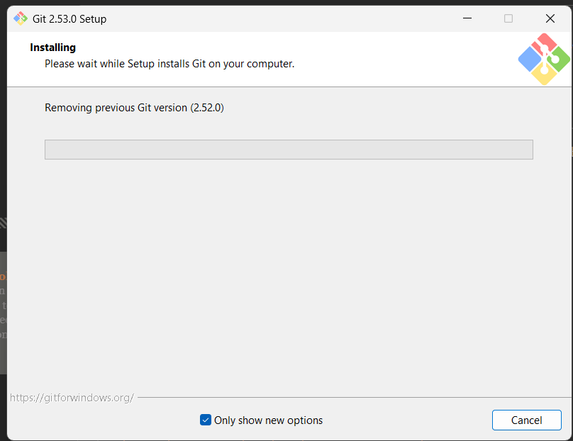

# KEST2VW-Lokaverkefni
## Liður 1 – Uppsetning á Windows og grunn stillingar

Í þessu verkefni setti ég upp tölvu fyrir lítið hugbúnaðarfyrirtæki. Ég byrjaði á því að undirbúa Windows 10 og framkvæmdi nýja uppsetningu. Í uppsetningarferlinu valdi ég “Setup for organization” og síðan “Domain join instead” til að búa til staðbundinn notanda.

Eftir að uppsetningu lauk bjó ég til minn eigin notanda og breytti nafni tölvunnar í KEST2VW-SamuelRegnault samkvæmt kröfum verkefnisins. Að því loknu setti ég upp nauðsynlegan hugbúnað, þar á meðal Python 3 (64 bita), Visual Studio Code með Python stuðningi og Git.

Ég prófaði að allt virkaði rétt með því að opna Python í skipanalínu og staðfesta að uppsetningin væri í lagi. Allar breytingar og uppsetningar voru skráðar í dagbók verkefnisins á GitHub.

